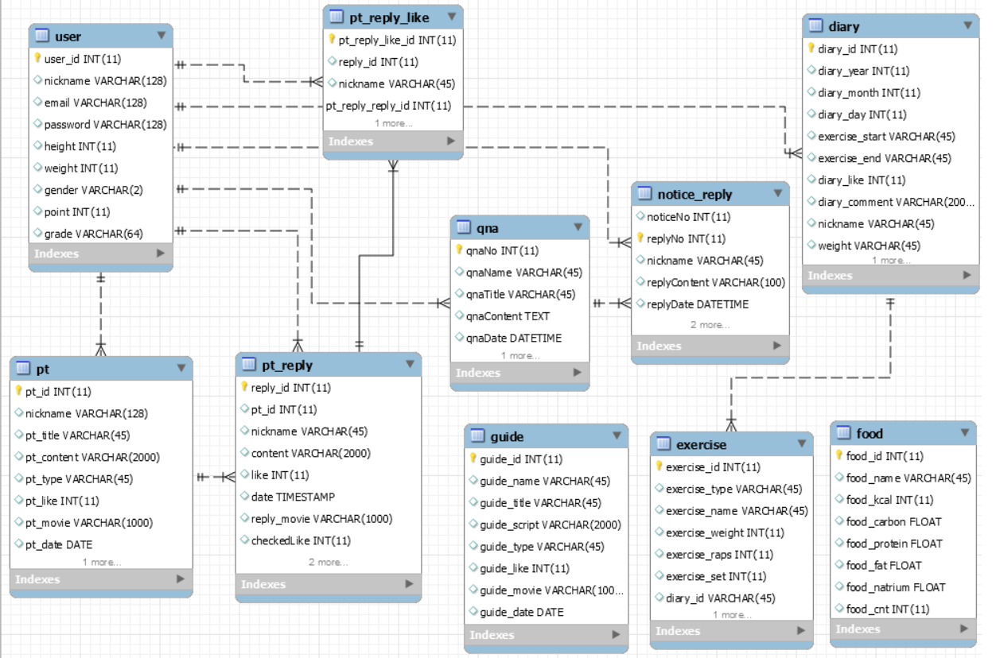

# Readme

> HEALTH COMMUNITY
>
> SSAFITNESS

### 개요

- 자세가 맞는지 확인하기 위해 매번 동영상을 찍어서 유튜버에게 신청해야하는 번거로움을 없애고자 함
- 기존의 텍스트만으로 이루어진 헬스 커뮤니티에서 벗어나 미디어 형태의 커뮤니티로 전환
- 어플로만 존재했던 다이어리 기능을 추가
- 매번 다이어트나 벌크업을 위해 필요한 매크로를 계산하는 번거로움을 줄일 수 있는 계산 기능 제공

### 소개

> 사용 언어 및 프레임워크

- Frontend
  - Vue.js
    - HTML
    - CSS
    - JS
- Backend
  - Spring
    - JAVA
  - DB
    - Maria db
    - MYSQL
    - Docker
- 형상 관리
  - gitlab
  - Jira

> 역할 분담

| 기능               | Frontend | Backend                          |
| ------------------ | -------- | -------------------------------- |
| 로그인 및 회원가입 | 부권남   | 부권남                           |
| PT                 | 박세진   | 부권남(article), 김정현(comment) |
| 운동 가이드        | 박세진   | 조제형(DB), 부권남               |
| 커뮤니티           | 백상혁   | 임건호                           |
| 다이어리           | 백상혁   | 김정현                           |
| 식단               | 박세진   | 김정현                           |

> ERD

> DB

| name               | table                  | function                                      |
| ------------------ | ---------------------- | --------------------------------------------- |
| user               | 회원 테이블            | 회원 정보를 가집니다                           |
| pt                 | Pt 테이블              | pt 게시글의 정보를 가집니다                    |
| pt_reply           | Pt 댓글 테이블         | 각 pt 게시글의 댓글 정보를 가집니다            |
| pt_reply_like      | Pt 댓글 좋아요 테이블  | 각 회원의 pt 댓글의 좋아요 여부 정보를 가집니다 |
| guide              | 가이드 테이블          |  가이드 영상(유튜브) 정보를 가집니다            |
| qna                | 자유게시판 테이블      | 자유 게시판 게시글의 정보를 가집니다            |
| notice_reply       | 자유게시판 댓글 테이블 | 게시판 댓글의 정보를 가집니다                   |
| diary              | 다이어리 테이블        | 회원의 다이어리 정보를 가집니다                 |
| exercise           | 운동 테이블            | 각 회원의 운동 정보를 가집니다                  |
| food               | 식단 테이블            | 음식의 정보를 가집니다                          |

### 기능 소개

> PT

- 글쓰기
  - 게시글에 동영상을 첨부하여 질문하는 형식
- 댓글 기능
  - 일반 사용자는 텍스트로만 댓글을 달 수 있고,  트레이너 사용자는 텍스트와 동영상을 댓글로 달 수 있다.
- 좋아요 기능
  - 댓글의 좋아요 기능을 추가하고, 좋아요가 가장 높은 댓글을 베스트 댓글로 추출함

> 운동 가이드

- 각 운동 종류별로 텍스트로된 간단한 설명과 유튜브 동영상 제공

> 커뮤니티

- 회원들 간의 자유로운 의사소통 가능

> 다이어리

- 다이어리 기능 제공
  - 운동일지
    - 운동 종류와 시간, 간단한 커멘트 작성 가능
    - 전체 달력에서는 해당 날짜의 운동 정보를 요약해서 보여줌
  - 그래프
    - 최근 한달 간의 몸무게 변화량을 그래프로 표현

> 식단

- 목적에 맞게 필요한 매크로를 제공
  - 성별, 신체 정보, 활동량, 목적을 입력함으로써 일일이 계산해야하는 번거로움 개선
- 간단한 식단 조합기능 제공
  - 계산된 매크로로 먹을 수 있는 음식이 어느정도인지, 또 어떻게 먹어야할지 직접 짜 볼 수 있는 기능